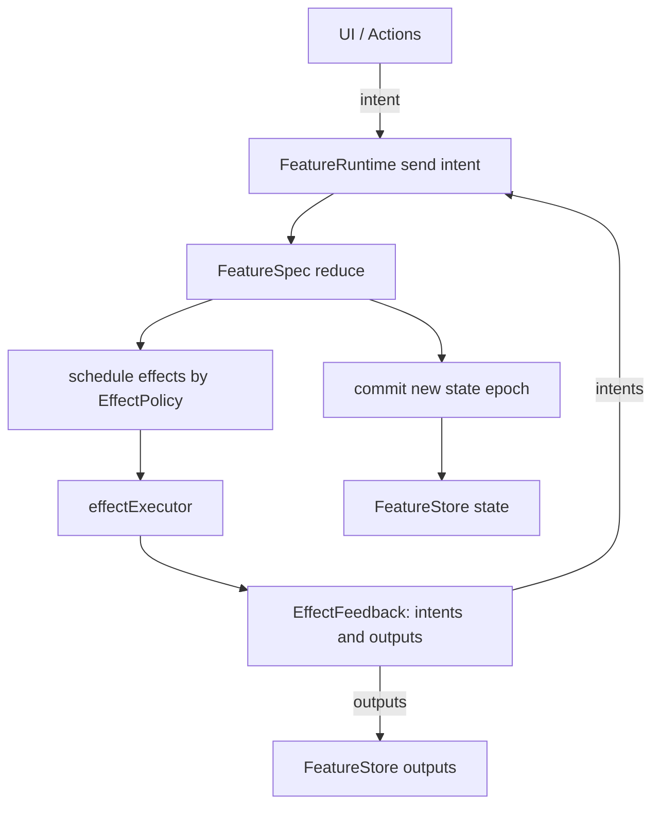

# Construkt: A Declarative UIKit Framework


## Table of Contents
- [Overview](#overview)
  - [Why Construkt?](#why-construkt)
- [Installation](#installation)
  - [Agentic Coding with Construkt](#agentic-coding-with-construkt)
- [Views and Composition](#views-and-composition)
  - [Custom Components](#custom-components)
  - [GeometryReader](#geometryreader)
  - [ScrollView](#scrollview)
  - [Group & ForEach](#group--foreach)
  - [ContainerView & DynamicContainerView](#containerview--dynamiccontainerview)
  - [Styles](#styles)
  - [Compiler Decoys (Anti-Hallucination)](#compiler-decoys-anti-hallucination)
- [State Management & Reactive Data Flow](#state-management--reactive-data-flow)
  - [The Reactive Primitives](#the-reactive-primitives)
  - [Binding to Views](#binding-to-views)
  - [Native Operators](#native-operators)
  - [Combine & RxSwift Integration](#combine--rxswift-integration)
  - [Included UI Components](#included-ui-components)
- [Feature Runtime (Deterministic State Machine)](#feature-runtime-deterministic-state-machine)
  - [Core Runtime Types](#core-runtime-types)
  - [Runtime Data Flow](#runtime-data-flow)
  - [Defining a FeatureSpec](#defining-a-featurespec)
  - [FeatureSpec Quick Start (What Each Type Means)](#featurespec-quick-start-what-each-type-means)
  - [Effect Policies & Concurrency Semantics](#effect-policies--concurrency-semantics)
  - [Stale Effects and Error Mapping](#stale-effects-and-error-mapping)
  - [FeatureStore API for UI Integration](#featurestore-api-for-ui-integration)
  - [Runtime Scope and Lifecycle](#runtime-scope-and-lifecycle)
  - [Runtime Journal for Debugging](#runtime-journal-for-debugging)
  - [Testing Runtime Features](#testing-runtime-features)
- [Modern Collection and Table Views](#modern-collection-and-table-views)
  - [Table Views](#table-views)
  - [Dynamic Collection Views](#dynamic-collection-views)
  - [Static Collection Views](#static-collection-views)
  - [Shimmer Loading States](#shimmer-loading-states)
- [Advanced View Structure](#advanced-view-structure)
- [Navigation & Auto-Routing](#navigation--auto-routing)
  - [Route Handler (Recommended)](#route-handler-recommended)
  - [Inline Route Handling with onReceiveRoute](#inline-route-handling-with-onreceiveroute)
  - [Coordinator Pattern](#coordinator-pattern)
  - [Declarative Routing](#declarative-routing)
  - [RouteChannel](#routechannel)
  - [ViewConvertable](#viewconvertable)
- [Bottom Sheets & Custom Presentations](#bottom-sheets--custom-presentations)
  - [SheetConfiguration](#sheetconfiguration)
  - [SheetTransitionStyle](#sheettransitionstyle)
- [Toast Notification System](#toast-notification-system)
  - [ToastConfiguration](#toastconfiguration)
  - [ToastManager API](#toastmanager-api)
- [Lifecycle Host Controller & Leak Detection](#lifecycle-host-controller--leak-detection)
  - [Lifecycle Modifiers](#lifecycle-modifiers)
  - [LifecycleHostTracker](#lifecyclehosttracker)
  - [LifecycleTrackerConfiguration](#lifecycletrackerconfiguration)
- [Author](#author)
- [Contribution](#contribution)
- [License](#license)

## Overview

Construkt lets you build UIKit-based user interfaces using a modern, declarative syntax identical to **SwiftUI**. 

It brings the joy of declarative composition and reactive data flow to legacy UIKit projects, making it possible to build dynamic, state-driven interfaces without Storyboards, NIBs, or Auto Layout boilerplate.

```swift
LabelView($title)
    .color(.red)
    .font(.title1)
```

By leveraging Swift's `ResultBuilder` pattern, Construkt composes native `UIView` hierarchies under the hood. You get the concise, readable syntax of SwiftUI while retaining the full power, predictability, and infinite customizability of UIKit.

### Why Construkt?

While SwiftUI is the future, many modern apps still maintain extensive UIKit codebases. Integrating SwiftUI via `UIHostingController` can be heavy and sometimes rigid. 

**Construkt solves this by being 100% UIKit.**

- **Native Reactive Core:** Construkt brings its own lightweight reactive primitives (`Property` and `Signal`) built natively with async/await and GCD. No external RxSwift or Combine dependencies required, though integration bridges are provided.
- **Zero Auto Layout Boilerplate:** Stacks (`VStackView`, `HStackView`, `ZStackView`) handle all the constraint logic for you natively.
- **Modern CollectionViews:** Build fully asynchronous `UICollectionView` and `UITableView` layouts using native Swift Diffable Data Sources with a few lines of code.

---

## Installation

Construkt is distributed as a Swift Package and requires **Xcode 16+** and **Swift 6** (with backwards compatibility for Swift 5.9 language modes).

**Minimum SDK Requirements:**
- iOS 14.0+

```swift
// Package.swift
dependencies: [
    .package(url: "https://github.com/MainActor-dev/Construkt.git", from: "1.0.0")
]
```

### Agentic Coding with Construkt

If you are using AI coding assistants (like Antigravity, Cursor, Windsurf, or GitHub Copilot), you can use the provided `SKILL.md` file to help your agent write high-quality Construkt code.

Simply inform your agent to read the `SKILL.md` file at the root of the repository. This file contains comprehensive guidelines, component references, and best practices for writing declarative UIKit with Construkt.


---

## Views and Composition

In Construkt, screens are composed of views inside views using familiar structuring. 

```swift
struct PosterCell: ViewBuilder {
    let movie: Movie
    
    var body: View {
        VStackView(spacing: 8) {
            ImageView(url: movie.posterURL)
                .shimmerable(true)
                .contentMode(.scaleAspectFill)
                .backgroundColor(.darkGray)
                .cornerRadius(8)
                .clipsToBounds(true)
                .height(180)
            
            VStackView(spacing: 4) {
                LabelView(movie.title)
                    .font(.systemFont(ofSize: 14, weight: .semibold))
                    .color(.white)
                    .numberOfLines(1)
                    .shimmerable(true)
                
                LabelView("Adventure") // Placeholder genre
                    .font(.systemFont(ofSize: 12))
                    .color(.gray)
                    .shimmerable(true)
            }
            .alignment(.leading)
        }
        .clipsToBounds(true)
    }
}
```

### Custom Components

Creating reusable components that can accept standard Construkt modifiers (like padding, sizing, etc.) is as simple as defining a struct that conforms to `ModifiableView`.

```swift
import UIKit

public class _CircleView: UIView {
    public override func layoutSubviews() {
        super.layoutSubviews()
        layer.cornerRadius = min(bounds.width, bounds.height) / 2
        clipsToBounds = true
    }
}

public struct CircleView: ModifiableView {
    public let modifiableView = _CircleView()
    
    public init() {
        modifiableView.translatesAutoresizingMaskIntoConstraints = false
        modifiableView.backgroundColor = .clear
    }
}
```


Any Construkt `ViewBuilder` protocol conformance generates an underlying set of standard `UIView` elements by simply calling `.build()`.

```swift
let view: UIView = PosterCell(movie: movie).build()
```

This structural approach encourages creating small, testable, highly-reusable interface components exactly like SwiftUI.

---

## State Management & Reactive Data Flow

Construkt does not diff and reconstruct the entire view tree on every state change like SwiftUI. Instead, it relies on explicit, highly-efficient **Reactive Bindings**.

### The Reactive Primitives

Construkt introduces two core primitives:
1. `Property<T>` — A state container that holds a value and emits updates on change (like `@Published` or `BehaviorRelay`).
2. `Signal<T>` — A transient event emitter that broadcasts values to subscribers without holding state (like `PublishRelay`).

```swift
class ProfileViewModel {
    @Variable var name: String = "John Doe" // Uses Property<String> under the hood
    let onProfileUpdated = Signal<Void>()

    func refresh() {
        name = "Jane Doe"
        onProfileUpdated.send()
    }
}
```

### Binding to Views

Construkt provides an extensive set of View Modifiers specifically designed for data binding. Use the `$` prefix to access the reactive projection of a Variable.

```swift
LabelView($viewModel.name) // Automatically updates the label when the name changes
    .font(.body)

ButtonView("Save")
    .hidden(bind: $viewModel.isSaving)

ActivityIndicator()
    .hidden(bind: $viewModel.isLoading.map { !$0 }) // Supports operators like map, filter, etc.
```

If you need a completely custom binding, use `onReceive`:

```swift
ImageView()
    .onReceive($viewModel.profileImage) { context in
        context.view.image = context.value
    }
```

> **Memory Management:** Cancellables strings are handled for you. Construkt injects a hidden `CancelBag` directly into instantiated UIViews. When a UIView deallocates, any reactive observation modifying that view is automatically torn down.

### Native Operators

Construkt's native binding system includes a rich suite of built-in operators so you don't need external reactive frameworks for everyday logic:
- `.map`, `.compactMap`
- `.filter`, `.skip`
- `.debounce(for:on:)`, `.throttle(for:latest:on:)`
- `.merge(with:)`, `.combineLatest(_:_:)`
- `.distinctUntilChanged()`, `.removeDuplicates(by:)`
- `.scan(_:_:)`
- `.eraseToAnyViewBinding()` — type-erase any `ViewBinding` into `AnyViewBinding<T>`

### Combine & RxSwift Integration

If your app already uses `Combine` or `RxSwift`, Construkt is fully agnostic. Simply import the corresponding bridging files:

```swift
import Construkt
import Combine // Import bridging extensions

let publisher = CurrentValueSubject<String, Never>("Combine Data")

LabelView(publisher) // Construkt treats Combine Publishers as native ViewBindings
```

### Included UI Components

Construkt provides declarative wrappers for most standard UIKit components:
- **Text & Controls:** `LabelView`, `ButtonView`, `TextField`, `TextEditor`, `Toggle`, `Slider`, `Stepper`
- **Layout & Spacing:** `VStackView`, `HStackView`, `ZStackView`, `Screen`, `SpacerView`, `DividerView`
- **Visual & Indicators:** `ImageView`, `BlurView`, `LinearGradient`, `ProgressView`, `ActivityIndicator`, `CircleView`

---

## Feature Runtime (Deterministic State Machine)

Construkt includes a runtime-first state machine architecture designed for large, side-effect-heavy UIKit features.

At a high level:

- `Intent` is an input event coming from UI/actions.
- `reduce` synchronously computes a new state and schedules effects/outputs.
- `effectExecutor` performs async work (API, storage, SDK wrappers) and returns feedback.
- feedback can emit new intents (loop back through reducer) and outputs (one-off events).

This model gives deterministic state updates, explicit side-effect scheduling, and predictable cancellation semantics.

### Core Runtime Types

Core runtime types live under `Sources/Construkt/Core/Runtime/`:

- `FeatureSpec`: declarative contract for state, intents, effects, outputs, and dependencies.
- `FeatureRuntime`: actor-based engine that runs reducer/effects and manages policies.
- `FeatureStore`: UI-facing wrapper that exposes reactive `Property<State>` and `Signal<Output>`.
- `EffectPolicy`: scheduling strategy per effect (`latest`, `queue`, etc).
- `RuntimeScope`: hierarchical cancellation and lifecycle ownership.
- `RuntimeJournal`: low-overhead trace of runtime events for diagnostics.

### Runtime Data Flow



### Defining a FeatureSpec

Use `FeatureSpec` to describe your runtime contract.

```swift
import Construkt

struct CounterFeature: FeatureSpec {
    struct State: Sendable, Equatable {
        var count = 0
        var isSaving = false
    }

    enum Intent: Sendable {
        case increment
        case save
        case saved
    }

    enum Effect: Sendable, Hashable {
        case persistCount(Int)
    }

    enum Output: Sendable {
        case didSave
    }

    struct Dependencies: Sendable {
        let save: @Sendable (Int) async throws -> Void
    }

    static var initialState: State { .init() }

    static func reduce(state: inout State, intent: Intent) -> ReduceResult<Effect, Output> {
        switch intent {
        case .increment:
            state.count += 1
            return .none
        case .save:
            state.isSaving = true
            return .init(effects: [.persistCount(state.count)])
        case .saved:
            state.isSaving = false
            return .init(outputs: [.didSave])
        }
    }

    static func policy(for effect: Effect) -> EffectPolicy {
        .dropIfRunning("counter-save")
    }
}
```

### FeatureSpec Quick Start (What Each Type Means)

When implementing `FeatureSpec`, define each type with this mental model:

| Type | What it is | Typical content |
|------|------------|-----------------|
| `State` | Persistent feature state | form values, loading flags, validation status, fetched models |
| `Intent` | Input events into reducer | user actions, lifecycle triggers, effect completion intents |
| `Effect` | Async work descriptors | API calls, storage writes, SDK operations |
| `Output` | One-off external events | navigation events, toast/snackbar events |
| `Dependencies` | Runtime dependency bag for effects | services, repositories, token providers, clock/device providers |

Reducer/runtime hooks:

- `initialState`: the first state when runtime boots.
- `reduce(state:intent:)`: pure synchronous transition that may schedule effects/outputs.
- `policy(for:)`: how each effect is scheduled (`latest`, `queue`, `dropIfRunning`, etc).
- `staleStrategy(for:)`: whether old async feedback is accepted (`.accept`) or dropped (`.drop`).
- `mapEffectError(_:effect:)`: optional typed recovery path from effect failures back into reducer intents.

Minimal implementation template:

```swift
struct ExampleFeature: FeatureSpec {
    struct State: Sendable, Equatable {
        var isLoading = false
        var message: String?
    }

    enum Intent: Sendable {
        case load
        case loaded(String)
        case failed(String)
    }

    enum Effect: Sendable, Hashable {
        case fetchMessage
    }

    enum Output: Sendable {
        case toast(String)
    }

    struct Dependencies: Sendable {
        let fetch: @Sendable () async throws -> String
    }

    static var initialState: State { .init() }

    static func reduce(state: inout State, intent: Intent) -> ReduceResult<Effect, Output> {
        switch intent {
        case .load:
            state.isLoading = true
            return .init(effects: [.fetchMessage])
        case .loaded(let value):
            state.isLoading = false
            state.message = value
            return .none
        case .failed(let message):
            state.isLoading = false
            return .init(outputs: [.toast(message)])
        }
    }

    static func policy(for effect: Effect) -> EffectPolicy {
        .dropIfRunning("example-load")
    }
}
```

### Effect Policies & Concurrency Semantics

`EffectPolicy` controls how each effect type runs:

- `.concurrent`: run all instances in parallel.
- `.latest(key)`: allow all to start, but only the newest result for that key is accepted.
- `.queue(key)`: serialize by key; next starts after previous completes.
- `.dropIfRunning(key)`: ignore new requests while one is active.
- `.restartable(key)`: cancel current and start the new request immediately.
- `.debounce(key, delay)`: delay execution and coalesce bursts by key.

Use stable, human-readable keys to make behavior obvious in code reviews and runtime logs.

### Stale Effects and Error Mapping

Two optional hooks on `FeatureSpec` help control async feedback behavior:

- `staleStrategy(for:)`:
  - `.drop` (default): discard effect feedback if state epoch changed since scheduling.
  - `.accept`: always apply feedback regardless of epoch drift.
- `mapEffectError(_:effect:)`:
  - convert effect failures into typed intents for reducer-driven recovery.
  - return `nil` to keep error handling external/no-op.

This keeps async error handling explicit and state-safe.

### FeatureStore API for UI Integration

`FeatureStore` is the UI integration point:

- `state: Property<F.State>` for bindings
- `outputs: Signal<F.Output>` for one-off events (navigation/toasts)
- `dispatch(_:)` for fire-and-forget intent sending
- `sendAndWait(_:)` to await reducer processing for the intent
- `sendAndDrain(_:)` to wait until runtime becomes idle (useful before reading derived state)

```swift
let store = FeatureStore<CounterFeature>(
    dependencies: .init(save: { count in
        try await api.saveCount(count)
    })
) { effect, dependencies in
    switch effect {
    case .persistCount(let value):
        try await dependencies.save(value)
        return .init(intents: [.saved])
    }
}

store.dispatch(.increment)
Task {
    await store.sendAndDrain(.save)
}
```

### Runtime Scope and Lifecycle

`RuntimeScope` owns cancellable runtime tasks.

- create a root with `RuntimeScope.root()`
- create child scopes with `makeChild()` for sub-flows
- `shutdown()` cancels registered tasks and recursively terminates children

This gives deterministic teardown for feature lifecycles and prevents orphaned work.

### Runtime Journal for Debugging

`RuntimeJournal` captures a bounded trace of runtime events such as:

- intent received
- state committed (epoch)
- effect scheduled/started/completed/cancelled/dropped/failed
- output published

Use `FeatureRuntime.journalSnapshot()` during debugging/tests to inspect policy behavior and race outcomes.

### Testing Runtime Features

Recommended testing split:

- `FeatureSpec` tests:
  - instantiate `FeatureStore` with mock dependencies
  - assert state transitions, output emissions, and effect-driven paths
  - include policy-sensitive cases (debounce/latest/queue/drop/restart)
- `Actions` tests:
  - verify SDK/bridge result mapping into intents
- `Bridge` tests:
  - verify third-party SDK error/value normalization into app-level types

For flows that depend on settled async state, prefer `sendAndDrain` in tests.

---

## Modern Collection and Table Views

Building lists in UIKit traditionally requires massive boilerplates, DTO mappings, and manual `reloadData()` calls. Construkt abstracts this all away.

### Table Views

`TableView` accepts a `DynamicItemViewBuilder` to declaratively map data to cells — no delegates, no data sources.

```swift
struct MainUsersTableView: ViewBuilder {
    
    let users: [User]
    
    var body: View {
        TableView(DynamicItemViewBuilder(users) { user in
            TableViewCell {
                MainCardView(user: user)
            }
            .accessoryType(.disclosureIndicator)
            .onSelect { context in
                context.push(DetailViewController(user: user))
                return false
            }
        })
    }
}
```

### Dynamic Collection Views

`CollectionView` leverages **DiffableDataSources** and supports multi-section layouts with headers, footers, and orthogonal scrolling — all via a `AnySection`-based `ResultBuilder` syntax.

```swift
CollectionView {
    AnySection(id: "trending", items: movies, header: Header { LabelView("Trending Now").font(.title1) }) { movie in
        AnyCell(movie, id: movie.id) { movieData in
            MoviePosterCell(movie: movieData)
        }
    }
    .layout(.horizontalOrthogonal(
        width: .fractionalWidth(0.8), 
        height: .fractionalHeight(1.0)
    ))
}
```

For non-array bindings, use `binding:`, `item:`, or `when:`:

```swift
CollectionView {
    // Bool gate: section exists only when true
    AnySection(id: "login", when: viewModel.showLoginBar) {
        AnyCell("login", id: "login") { _ in
            LoginBarCell()
        }
    }

    // Single model binding (non-array)
    AnySection(id: "profile", item: viewModel.profile) { profile in
        AnyCell(profile, id: profile.id) { model in
            ProfileCell(model: model)
        }
    }

    // Optional model binding (renders nothing when nil)
    AnySection(id: "promo", item: viewModel.activePromo) { promo in
        AnyCell(promo, id: promo.id) { model in
            PromoCell(model: model)
        }
    }
}
```

### Static Collection Views

You can also build statically-defined declarative collections (e.g., Settings menus) by listing explicit `AnyCell` components within a `AnySection`:

```swift
CollectionView {
    AnySection(id: "settings", header: Header { LabelView("General") }) {
        AnyCell("Notifications", id: "notifications") { title in
            SettingsRowView(title: title)
        }
        AnyCell("Privacy", id: "privacy") { title in
            SettingsRowView(title: title)
        }
    }
}
```

### Shimmer Loading States
Building sophisticated loading UIs is built-in natively:

```swift
AnySection(id: "popular", items: movies) { movie in
    AnyCell(movie, id: movie.id) { movieData in 
        MoviePosterCell(movie: movieData) 
    }
}
.shimmer(count: 5, when: $viewModel.isLoading) {
    MoviePosterCell(movie: .placeholder)
}
```

When `isLoading` is true, Construkt automatically generates 5 shimmer placeholder geometries based on your ViewBuilder structure and animates a shimmer gradient across them. When the data loads, it cross-dissolves them back to your actual fetched data natively.

---

## Advanced View Structure

While stacks are primary, Construkt exposes powerful layout control through direct anchors, offsets, and geometry modifiers.

```swift
ZStackView {
    ImageView(backdropImage)
        .contentMode(.scaleAspectFill)
    
    // Auto-calculating overlay gradients
    LinearGradient(colors: [.black.withAlphaComponent(0), .black])
    
    LabelView("Featured Content")
        .color(.white)
        .position(.bottomLeft)
        .margins(h: 20, v: 20)
}
.height(300)
.clipsToBounds(true)
```

Unlike SwiftUI, you don’t have to fight the layout system. A `ViewBuilder` is just generating traditional `UIView` nodes. You can access the UIKit primitives at any point using `with`:

```swift
LabelView("Direct UIKit Access")
    .with { label in
        // 'label' is guaranteed to be a UILabel
        label.shadowColor = .lightGray
        label.shadowOffset = CGSize(width: 1, height: 1)
    }
```

### Screen Layout Container

`Screen` is a high-level layout component that provides a standard page architecture with content and navigation bar slots. It replaces manual `ZStackView` + `.position(.top)` boilerplate:

```swift
struct HomeView: ViewConvertable {
    func asViews() -> [View] {
        Screen {
            CollectionView {
                heroSection
                popularSection
            }
            .onScroll { scrollView in
                scrollBinding.offset = scrollView.contentOffset.y
            }
        }
        .navigationBar {
            HomeNavigationBar(
                scrollOffset: scrollBinding.$offset.eraseToAnyViewBinding()
            )
        }
        .backgroundColor(UIColor("#0A0A0A"))
        .asViews()
    }
}
```

The `Screen` component handles Z-stacking and pinning automatically. Each screen can provide a completely distinct navigation bar UI while the layout structure remains consistent.

### Scroll-Driven Helpers

Construkt includes a `CGFloat` extension for normalizing scroll offsets into 0…1 progress values, useful for scroll-driven animation effects:

```swift
let progress = scrollOffset.scrollProgress(over: 100) // 0.0 → 1.0 over 100pt
navBarBackground.alpha = progress
```

---

## Navigation & Auto-Routing

Construkt includes a flexible navigation engine with two approaches: **ConstruktRouteHandler** for centralized route handling, and **ConstruktCoordinator** for coordinator-tree architectures. Both use UIKit's responder chain so views never hold direct references to navigation logic.

### Route Handler (Recommended)

Define routes as an enum, then create a centralized handler that manages all navigation:

```swift
enum AppRoute: Codable {
    case movieDetail(movieId: String)
    case movieList(title: String, genreId: Int?)
    case search
}

final class AppRouteHandler: ConstruktRouteHandler<AppRoute> {
    override func handle(_ route: AppRoute, sender: Any?) -> Bool {
        open(route, animated: true)
        return true
    }

    func open(_ route: AppRoute, animated: Bool = true) {
        switch route {
        case .movieDetail(let id):
            let screen = MovieDetailView(movie: movie)
                .onReceiveRoute(MovieDetailRoute.self) { [unowned self] route in
                    switch route {
                    case .back:
                        navigationController?.popViewController(animated: true)
                        return true
                    case .similarMovie(let movie):
                        open(.movieDetail(movieId: String(movie.id)))
                        return true
                    }
                }
                .toPresentable()
            router.push(screen, animated: animated, receiver: self)
        case .search:
            router.push(SearchViewController(), animated: animated, receiver: self)
        // ...
        }
    }
}
```

### Inline Route Handling with `onReceiveRoute`

Use `.onReceiveRoute` to attach route handlers directly when constructing screens:

```swift
HomeView()
    .onReceiveRoute(HomeRoute.self) { [unowned self] route in
        switch route {
        case .movieDetail(let id): open(.movieDetail(movieId: id))
        case .search: open(.search)
        }
        return true
    }
    .toPresentable()
```

### Coordinator Pattern

For larger apps with complex navigation hierarchies, Construkt provides a full **Coordinator** tree. Coordinators own navigation logic and form a parent-child hierarchy via `store()`/`free()`:

```swift
final class HomeCoordinator: BaseCoordinator, RouteHandlingCoordinator {
    typealias Event = HomeRoute
    let router: ConstruktRouter

    init(router: ConstruktRouter) {
        self.router = router
    }

    override func start() {
        let homeVC = HomeView(viewModel: viewModel).toPresentable()
        router.setRoot(homeVC, hideBar: true, animated: false, receiver: self)
    }

    func canReceive(_ event: HomeRoute, sender: Any?) -> Bool {
        switch event {
        case .movieDetail(let id):
            let detailVC = MovieDetailView(movie: movie).toPresentable()
            router.push(detailVC, animated: true, receiver: self)
            return true
        case .search:
            let searchVC = SearchViewController()
            router.push(searchVC, animated: true, receiver: self)
            return true
        }
    }
}
```

Key concepts:
- **`BaseCoordinator`** — base class with `children` array and `start()`. Override `start()` to set up the initial screen.
- **`RouteHandlingCoordinator`** — protocol combining `ConstruktCoordinator` + `RouteReceiving`. Requires a `router` property and `canReceive()` to handle events.
- **`ConstruktRouter`** — protocol for navigation actions (`push`, `pop`, `present`, `dismiss`, `setRoot`). Use `DefaultRouter` as the concrete implementation.
- **`receiver: self`** — the `receiver` parameter binds the coordinator to the pushed view controller via associated objects, so route events from that screen flow back to the correct coordinator.

### Declarative Routing

Attach navigation intent directly to collection view sections using two explicit modifiers:

| Modifier | Signature | Purpose |
|----------|-----------|---------|
| `.onSelect` | `(T) -> Void` | Imperative side-effects (analytics, ViewModel calls) |
| `.onRoute` | `(T) -> E` | Declarative routing — auto-bubbles via responder chain |
| `.onRoute` | `(T) -> E?` | Optional variant — routes only when non-nil |

```swift
// Declarative: returns an event, automatically routed via the responder chain
AnySection(id: "popular", items: movies) { movie in
    AnyCell(movie, id: movie.id) { movie in PosterCell(movie: movie) }
}
.onRoute { (movie: Movie) in
    AppRoute.movieDetail(movieId: String(movie.id))
}
```

Any `UIView` can also trigger navigation directly using `UIResponder.route()`:

```swift
// From a tap gesture — routes from the sender view's responder chain
.onTapGesture { context in 
    context.view.route(HomeRoute.search, sender: nil) 
}

// Or declaratively on any view
ImageView(UIImage(systemName: "magnifyingglass"))
    .onRoute(AppRoute.search)
```

### ViewConvertable

Screens are pure structs that produce declarative view hierarchies. The framework wraps them in `LifecycleHostController` for UIKit integration:

```swift
struct HomeView: ViewConvertable {
    let viewModel: HomeViewModel

    func asViews() -> [View] {
        Screen {
            CollectionView {
                AnySection(id: "movies", items: viewModel.movies) { movie in
                    AnyCell(movie, id: movie.id) { movie in PosterCell(movie: movie) }
                }
                .onRoute { (movie: Movie) in
                    HomeRoute.movieDetail(movieId: String(movie.id))
                }
            }
        }
        .navigationBar {
            HomeNavigationBar(scrollOffset: scrollBinding.$offset.eraseToAnyViewBinding())
        }
        .onHostDidLoad { viewModel.load() }
        .asViews()
    }
}
```

Events bubble up the UIKit responder chain → reach the `LifecycleHostController` → handled by the registered `onReceiveRoute` handler or `ConstruktRouteHandler`. No direct references between views and navigation logic.

---

## Author

Previously, this was **Builder**. Originally created by **Michael Long**.
- Github: [Builder](https://github.com/hmlongco/Builder)

Continued and improved as **Construkt** and maintained by **Bayu Kurniawan**.
- GitHub: [@thatswiftdev](https://github.com/thatswiftdev)

---

## Contribution

Contributions are welcome! If you have ideas, bug reports, or want to add new features, feel free to open an issue or submit a pull request.

---

## License

Construkt is available under the MIT license. See the LICENSE file for more info.
